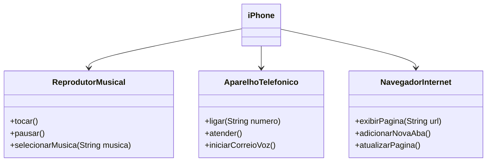

# POO - Desafio

### Modelagem e Diagramação de classes do iPhone

Neste desafio, foi proposto e realizado a modelagem e diagramação de uma representação UML do componente iPhone, abrangendo suas funcionalidades como Reprodutor Musical, Aparelho Telefônico e Navegador na Internet. Com base no vídeo de lançamento do iPhone de 2007 (link abaixo), foram extraidas as informações relevantes para a diagramação das classes e interfaces utilizando uma ferramenta UML para conclusão do desafio.

[Lançamento iPhone 2007](https://www.youtube.com/watch?v=9ou608QQRq8)
- Minutos relevantes: 00:15 até 00:55

#### Funcionalidades modeladas
1. **Reprodutor Musical**
   - Métodos: `tocar()`, `pausar()`, `selecionarMusica(String musica)`
2. **Aparelho Telefônico**
   - Métodos: `ligar(String numero)`, `atender()`, `iniciarCorreioVoz()`
3. **Navegador na Internet**
   - Métodos: `exibirPagina(String url)`, `adicionarNovaAba()`, `atualizarPagina()`

### Objetivo
1. Criar um diagrama UML que represente as funcionalidades descritas acima.

   

### Resolução: Diagrama UML (Mermaid)

